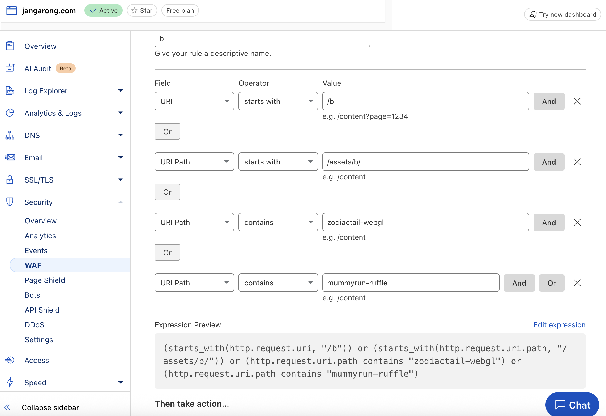

This is a [Next.js](https://nextjs.org) project bootstrapped with [`create-next-app`](https://nextjs.org/docs/app/api-reference/cli/create-next-app).

## Getting Started

First, run the development server:

```bash
npm run dev
# or
yarn dev
# or
pnpm dev
# or
bun dev
```

Open [http://localhost:3000](http://localhost:3000) with your browser to see the result.

You can start editing the page by modifying `app/page.tsx`. The page auto-updates as you edit the file.

This project uses [`next/font`](https://nextjs.org/docs/app/building-your-application/optimizing/fonts) to automatically optimize and load [Geist](https://vercel.com/font), a new font family for Vercel.

## Learn More

To learn more about Next.js, take a look at the following resources:

- [Next.js Documentation](https://nextjs.org/docs) - learn about Next.js features and API.
- [Learn Next.js](https://nextjs.org/learn) - an interactive Next.js tutorial.

You can check out [the Next.js GitHub repository](https://github.com/vercel/next.js) - your feedback and contributions are welcome!

## Deploy on Vercel

The easiest way to deploy your Next.js app is to use the [Vercel Platform](https://vercel.com/new?utm_medium=default-template&filter=next.js&utm_source=create-next-app&utm_campaign=create-next-app-readme) from the creators of Next.js.

Check out our [Next.js deployment documentation](https://nextjs.org/docs/app/building-your-application/deploying) for more details.

This is a Next.js based website with a few special things added:

* `/posts/` is used to add static posts in `.mdx` (Markdown) format. See the existing posts for examples.
* There is a "corp" set of files that will not be committed to the repository. (corp = LAN server I run privately) **Please back these gitignored files separately!**
    * `/posts/<name>.corp.mdx` - Posts with this format are intended to be accessed via the corp network.
    * `/public/assets/b/log/corp/<anything>` - Any assets stored here will not be committed. Please use this directory for any assets the corp posts will need.
    * For archive page:
        * `/src/app/b/archive/page.tsx` - This is the archive page which routes to archived singlefiles.
        * `/public/b/archive/*` - This contains archived pages stored in singefile.

Side B development has been paused. Expect bugs on this website!

## cloudflare



Add Captcha to the following URL paths.

