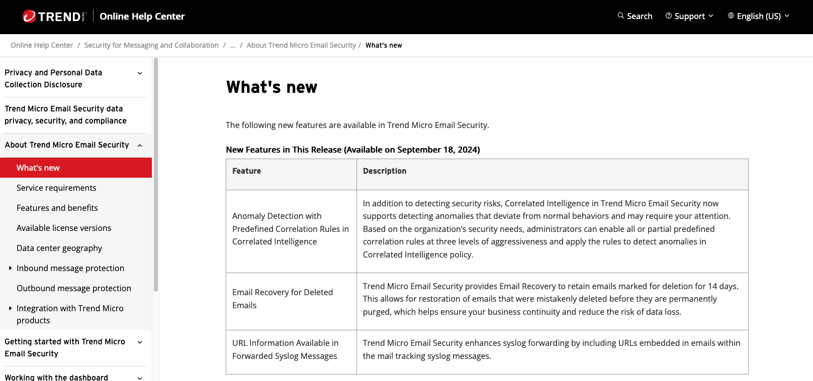

<b>Feature Doc:</b> <a href="https://docs.trendmicro.com/en-US/documentation/article/trend-micro-email-security-online-help-emailrecovery">https://docs.trendmicro.com/en-US/documentation/article/trend-micro-email-security-online-help-emailrecovery</a>

## Feature Intro
At Trend Micro Email Security's product, users can configure various policies that can secure
the customer's inbox. This can include Domain blocklists, IP reputation, viruses, and much more! You can
also configure your policies to take immediate action on what to do with targeted emails- this
can either be sending the email to quarantine, or deleting it outright.

However, there is always a chance that these emails could be false positives, or there is some
user error in configuring policies, which could lead to permanent data loss.

TMEMS' Email Recovery feature fixes this! Basically if the customer gives us permission, 
we will restore emails that have been deleted/quarantined due to false-positives.

## My Role
For this feature, I worked on microservices related to email storage and ingestion, and
updating our log pipelines to ensure emails with this feature enabled don't get deleted.
We also developed an internal tool that helped with performing the actual recovery part,
which releases emails to their intended recipient.

This also includes updating the Mail Tracking Logs to show to customers to support the new
email statuses (i.e. recovered) and an opt-in/out page the customer can access to enable
Email Recovery.
