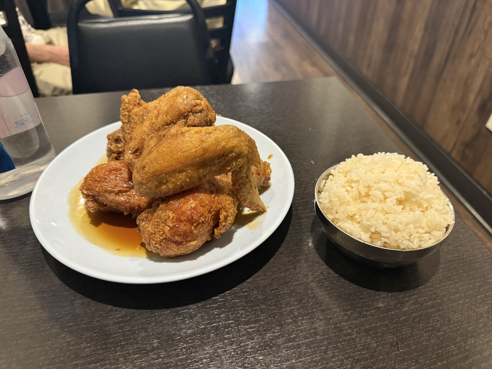
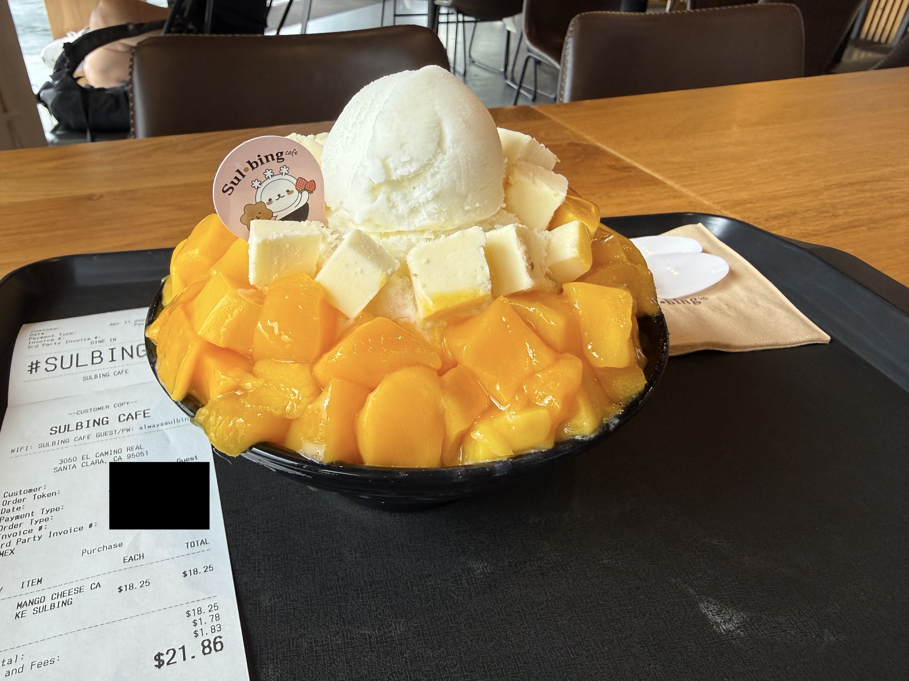

Had 99 chicken based on what I've read online (plus the obvious NVIDIA CEO recommendation).
Reviews on social media are mixed but thought I'd give it a go anyways since I haven't had Korean Fried Chicken
yet in the Bay Area. I got the 5 piece Soy Chicken with rice.

Surprisingly very good, definetly on par with the best I've had in Toronto!

Went to Sulbing right after for their Mango Cheesecake Bingsu, and it was awesome! Not a pure
Mango dessert but it's one of the best desserts I've had in the Bay Area so far.

Only downside to both of these meals is that they're quite expensive, so I won't be visiting often.

Very solid, 8.5/10 :)
