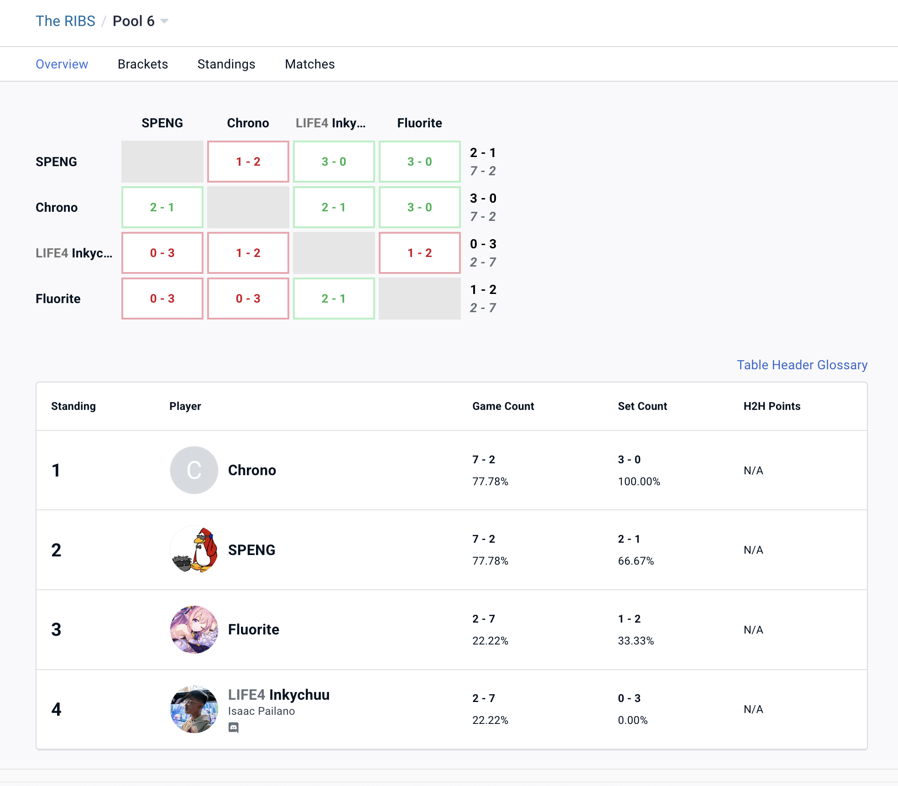
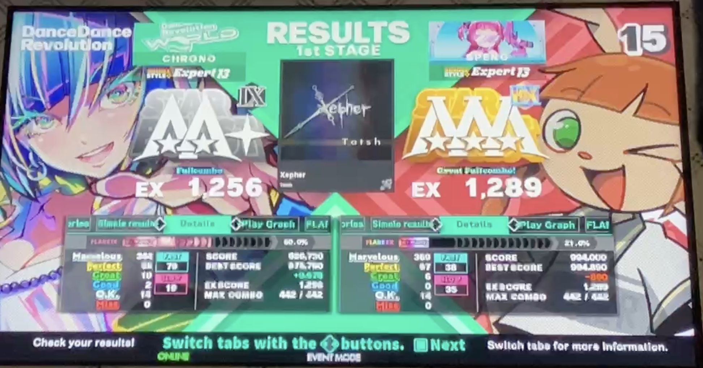
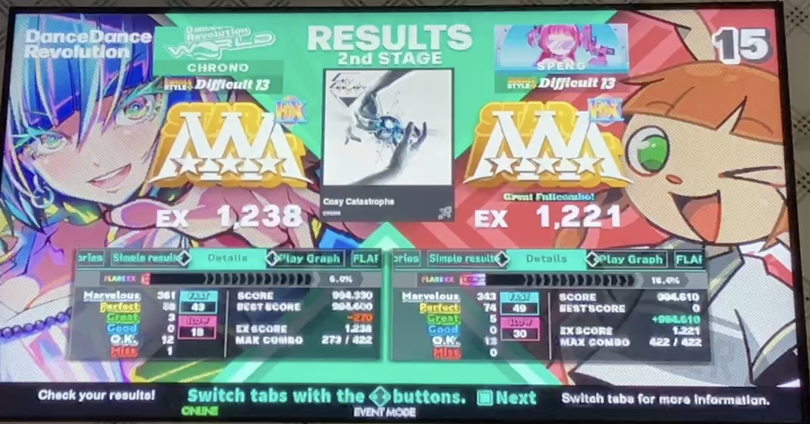
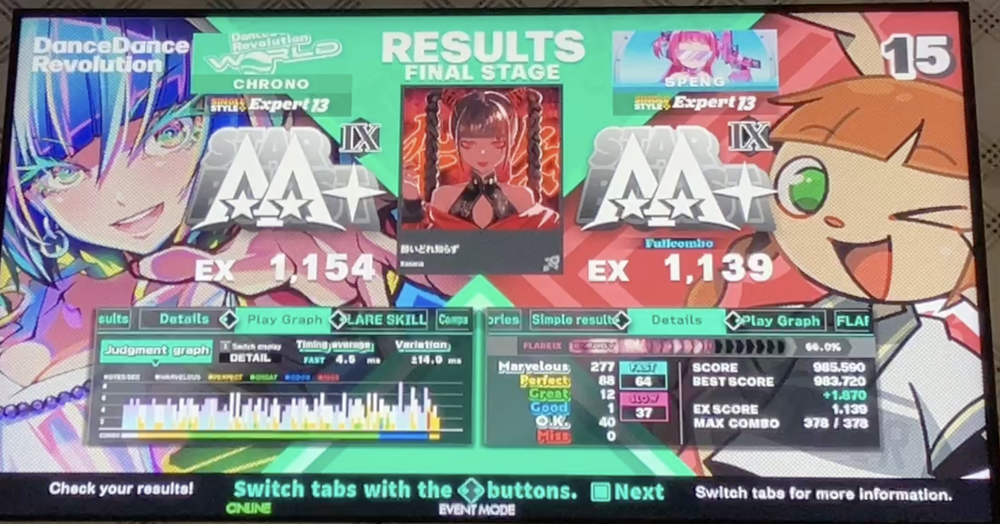
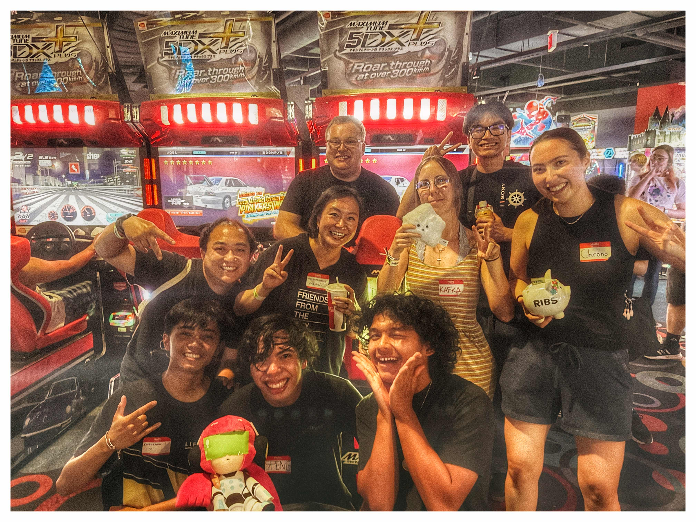

Did my first ever casual tournament in DDR!

It was very intense and was lots of fun meeting and watching my friends at Stonestown compete!

In my group, I was undefeated for the most part until my match with CHRONO.
It was the most intense match of DDR I've ever had!

The match started with my pocket pick, Xepher ESP 13 being drawn, and winning with 33 EX Points.
I've played this song many times before since I was a kid, so I was happy to keep this win.

Round 2 began with CHRONO's pocket pick Cozy Catastrophe DSP 13, and it was pretty close until the BPM changes.
She ended up winning with over 17 EX points, thus making the last song the tiebreaker that determines the winner
of our divison!

I ended up choosing 酔いどれ知らず (it's a Kanaria song) ESP 13. The gallops were challenging and like the last round,
it was also pretty close, but she was able to maintain her lead in the song with 15 EX points! Darn!

This was the most fun I had in the Bay Area! All of us from Stonestown hung out after the tournament and we played
more DDR in our friend's basement until 10PM lol

