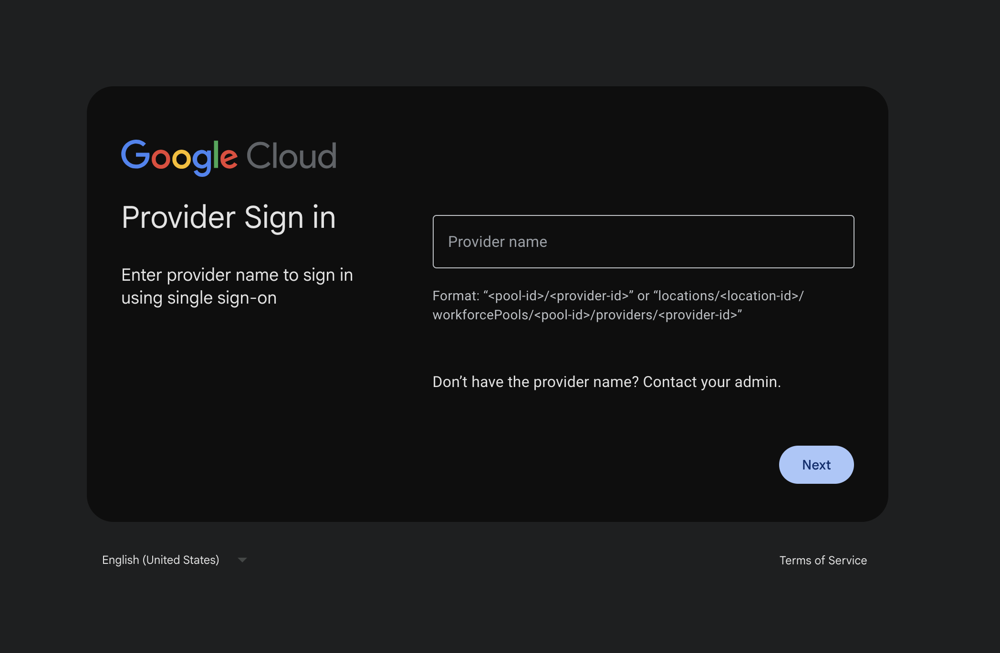

## Local Storage Sessions + UI Refresh

<b>General Doc:</b> <a href="https://docs.cloud.google.com/iam/docs/workforce-console-sso">https://docs.cloud.google.com/iam/docs/workforce-console-sso</a>

A few months ago, with the great collaboration from my team lead and members from Workforce Identity, 
we redesigned the UI to use Material 3 components for the `/signin` and `/select-session` page!

But most importantly, we allowed session info to be stored in local storage. It's there for the
user's convenience of logging into a signed out/expired session long past the session cookie gets
expired.

I partially designed and fully implemented this feature. It involved a lot of flow modifications and
paying close attention to our auth service behaves before and after the user authenticates with the
IdP.

## Debug IdP Attribute Mappings

<b>Feature Doc:</b> <a href="https://docs.cloud.google.com/iam/docs/configuring-workforce-identity-federation#verify-provider-config">https://docs.cloud.google.com/iam/docs/configuring-workforce-identity-federation#verify-provider-config</a>

With collaboration with the Cloud Console UI team and the Workforce Identity team, we launched this
new feature that allows users to debug their attribute mappings and conditions!

For context, IdPs (Identity Providers) provide attribute mappings as part of their authentication response which
can be used for metadata (i.e. attribute.email is their username) or for authentication (i.e. 
is their attribute.groups in the list of permitted groups to access this resource?). People
need to configure their attribute mappings per IdP since each IdP is unique.

What this feature does is allow users to debug their IdP attribute mappings by displaying
to the users what attributes are fetched from the IdP response upon authentication, and allow
the user to configure their mappings on the same page, thus allowing the user to debug their
attribute mapping without having to dig into their IdP for these attributes.

My role in this feature is on the Console's cloud identity backend, where I work on a service
that handles the request and response between our workforce microservices and the cloud console's
frontend, while ensuring we have the correct integrations in place for this new backend endpoint.
This includes IAM permissions, Cloud Audit Logging, etc.

