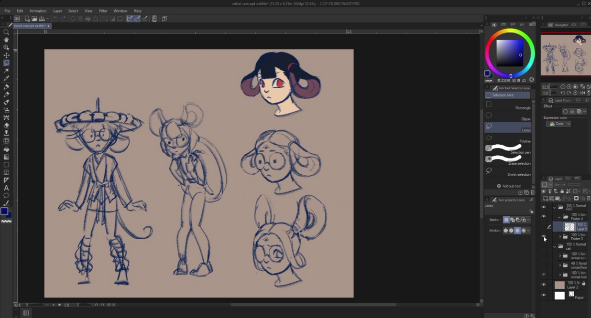
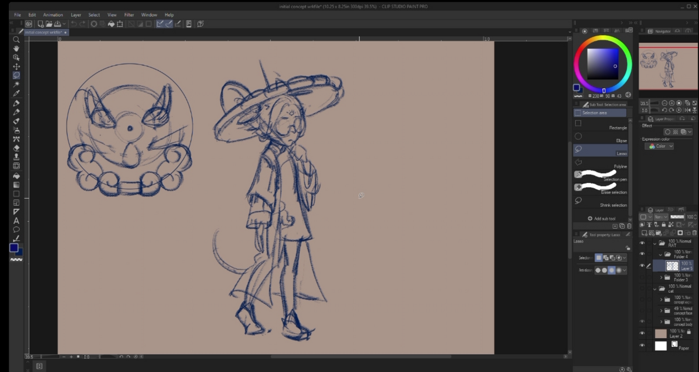
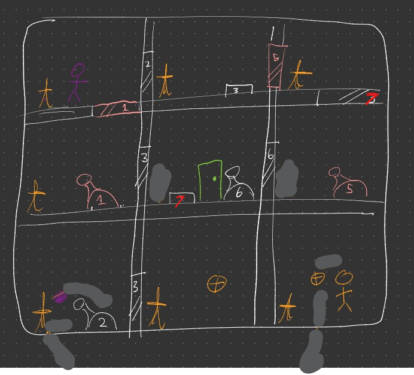

## Zodiac Tail's Debut

Just another update which includes me finishing the Proof of Concept (in a very buggy state)! 
It took many weeks, but now it's ready. 
I'll be spending the next few weeks fixing these bugs and integrating assets now that the artist team is ready.

However, one thing I quickly noticed for this project is that I'm.... managing again. I've rarely led meetings before and was not 
successful in the past with landing personal group projects led by me before.

In the meantime, here is some new designs from the game presented by Amy during our first "all hands":

And a mockup for one of the more challenging levels designed by Amy and I!

I have a meeting every Sunday at 7PM now, so expect a ZodiacTail update on Sundays then? 

